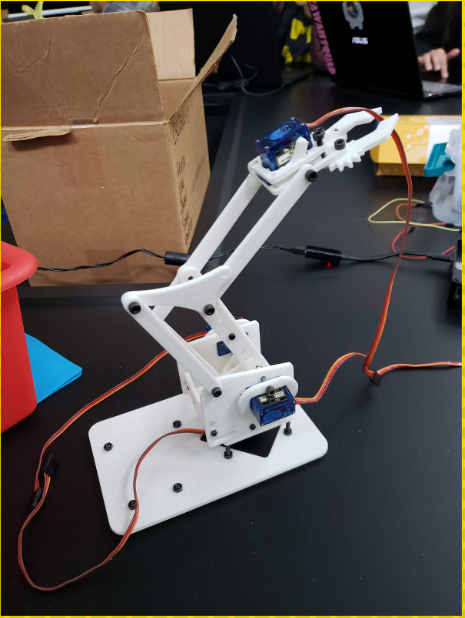

<div class="ui small rounded images">
  
</div>
This is a robotic arm a group and I have developed for computer architecture. We were supposed to hook it up to some joysticks so it could be controlled that way, but it didn't turn out the way it should, mainly because the joysticks were not being detected.

Here is some code that illustrates how we read values from the line sensors:
```python
import RPi.GPIO as GPIO

import time
import getch
servoPIN = 17
GPIO.setmode(GPIO.BCM)
GPIO.setup(servoPIN, GPIO.OUT)

p = GPIO.PWM(servoPIN, 50) # GPIO 17 for PWM with 50Hz
p.start(2.5) # Initialization
def servo1_left():
    p.ChangeDutyCycle(10)
    time.sleep(.1)
    return

def servo1_right():
    p.ChangeDutyCycle(2.5)
    time.sleep(.1)
    return

while True:
    char = getch.getch()
    if(char == "a"):
        servo1_left()
  
    if(char == "d"):
        servo1_right()

    if(char == "x"):
        break
```
